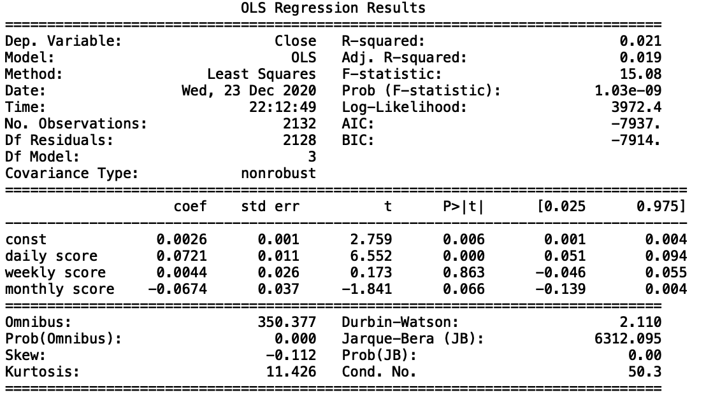

```{r setup, include=FALSE}
knitr::opts_chunk$set(echo = TRUE)
```

## Introduction

In our project we want to test the predictive power of Reddit submissions on the
returns of cryptocurrencies. First, submission data from the Reddit
websites Bitcoin and Ethereum Subreddits was collected from 2015 until December 2020.
Then a sentiment analysis on the submission titles and the submission texts was run
using the XXYY dictionary. As there are numerous submissions per day, the daily / weekly / monthly
sentiment score is the mean sentiment of all submissions per day / week / month, weighted by the
number of "upvotes" each submission received. In a final step OLS regression with three 
independent variables is used to test the predictive power of Reddit submissions
on daily Bitcoin and Ethereum returns. The returns being the dependent variable
and daily, weekly and monthly sentiment scores being the independent variables.
Todays returns are regressed on yesterdays, previous weeks and previous months sentiment score.


## Reddit

Reddit is a social news aggregation and discussion website. It is a major discussion
forum for crypto related content. Users have only limited restrictions to contributing
content on the website allowing a very free sharing of information.
Due to the lack of cryptocurrencie coverage by traditional media, many investors
seek advise and information regarding cryptos on Reddit and similar websites.
Therefore, Reddit submissions were chosen as predictors for this project.

## Sentiment Analysis

## Word Clouds
The wordclouds on the following slides show accumilations of the most used words in the Bitcoin and Ethereum
Subreddits from 2015 to 2020, with the exclusion of selected stopwords.


## Bitcoin Wordcloud
```{r btc_wc, echo=FALSE, fig.cap="", out.width = '80%'}

```


## Ethereum Wordcloud
```{r eth_wc, echo=FALSE, fig.cap="", out.width = '80%'}
knitr::include_graphics("eth_wordcloud.png")
```

## OLS Regression
An OLS regression was preformed with daily returns of the crypto currencies as the 
dependent variable and daily, weekly and monthly polarity scores as the three 
independent variables.

## Bitcoin OLS Regression
```{r btc_ols, echo=FALSE, fig.cap="OLS Regression Bitcoin", out.width = '80%'}

```
## Ethereum OLS Regression
```{r eth_ols, echo=FALSE, fig.cap="OLS Regression Ethereum", out.width = '79%'}
knitr::include_graphics("eth_ols.png")
```

## Results


